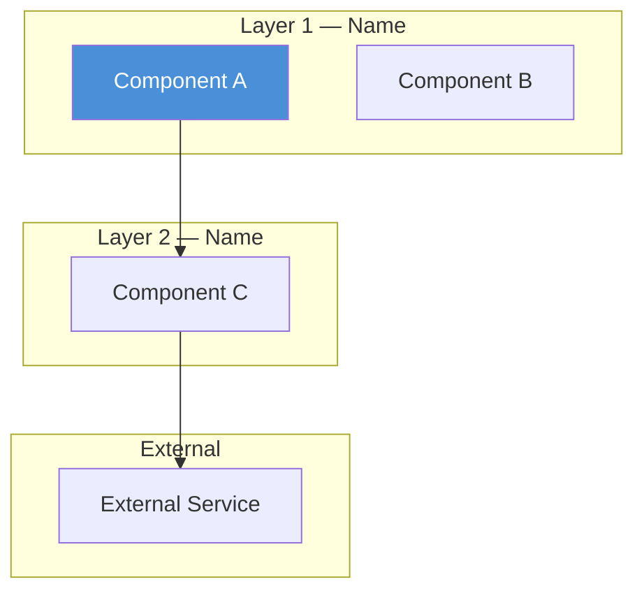
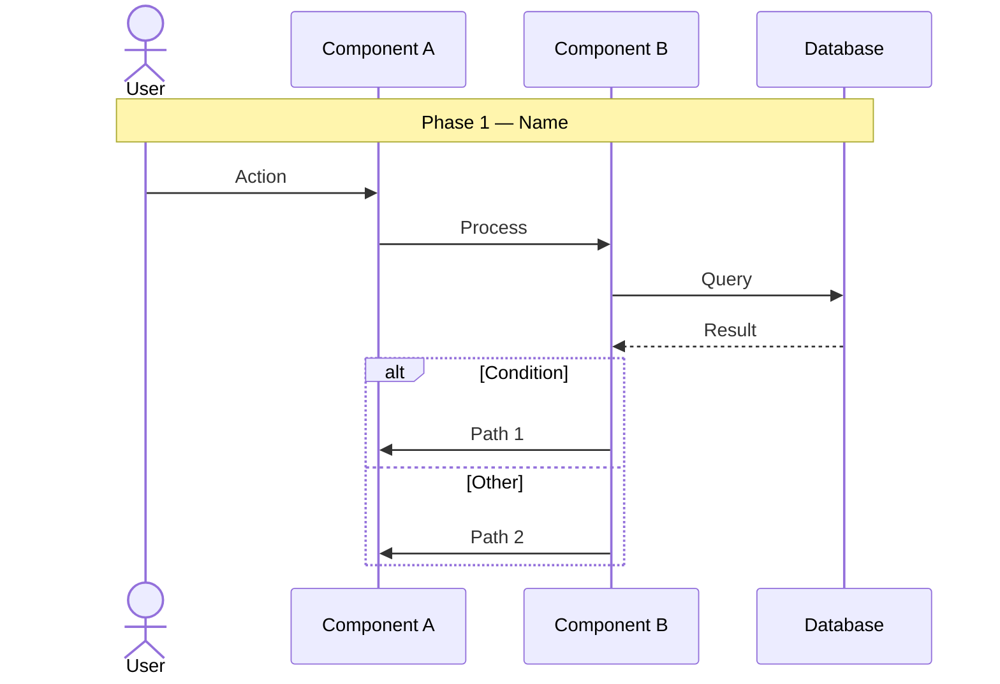
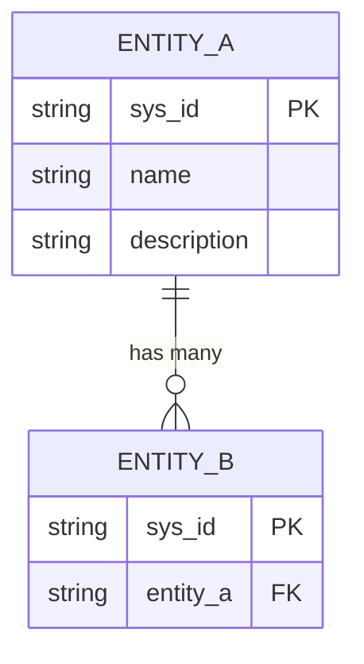

# Reverse Engineer Architecture from Documentation

Systematically analyze a codebase wiki, documentation set, or source code to produce a comprehensive set of Mermaid architecture diagrams. The goal is to turn implicit knowledge spread across many files into explicit, visual architecture artifacts.

## When to Use

- User says "reverse engineer", "document the architecture", "make sense of this codebase/wiki"
- User wants diagrams (ERD, sequence, architecture) generated from existing docs or code
- User needs to onboard onto an unfamiliar system and wants a visual overview
- User wants to reconstruct the original design from implementation artifacts

## Phase 1 — Discovery & Inventory

### 1a. Identify the Documentation Source

Determine what you're working with:

| Source Type | How to Explore |
|---|---|
| GitHub Wiki | Glob for `*.md` files, read `Home.md` and `_Sidebar.md` first |
| Docs folder | Glob recursively, look for README, index, or table-of-contents files |
| Source code | Glob for code files, look for architecture docs, ADRs, comments |
| Mixed | Combine approaches; prioritize docs over code for initial understanding |

### 1b. Build a File Inventory

```
Glob: **/*.md (or **/*.{md,mdx,rst,txt})
```

Read the top-level entry point first (Home.md, README.md, index.md). This usually provides the navigation structure and recommended reading order.

### 1c. Categorize Files by Topic

Group files into categories. Common categories:

- **Core Architecture** — system overview, layers, components
- **Patterns / Flows** — how requests flow through the system
- **Data Model** — tables, entities, relationships, DAOs
- **Developer Guides** — setup, troubleshooting, contributing
- **API / Integration** — external APIs, protocols, inter-service communication
- **Configuration** — setup, environment, feature flags
- **UI / Frontend** — components, events, data binding
- **Operations** — monitoring, logging, testing

Present the inventory to the user as a summary table before proceeding.

## Phase 2 — Deep Read & Knowledge Extraction

### 2a. Prioritize Reading Order

Read files in this order (most architectural value first):

1. Architecture overview / system design docs
2. Glossary / terminology docs (establishes vocabulary)
3. Pattern / flow docs (establishes how components interact)
4. Data model / schema docs (establishes entities and relationships)
5. API / integration docs (establishes external boundaries)
6. Everything else as needed

### 2b. Extract Key Architectural Elements

While reading, build mental models of:

**Layers & Components:**
- What are the major layers? (e.g., UI, API, Business Logic, Data Access)
- What components exist in each layer?
- What are the key files/classes/modules in each component?

**Entities & Relationships:**
- What are the core domain entities? (tables, models, classes)
- How do they relate to each other? (1:1, 1:N, M:N)
- What are the junction/M2M tables?

**Flows & Sequences:**
- What is the primary request flow? (user action → response)
- What are the key decision points? (branching, strategy selection)
- What external services are called?

**Protocols & Integration:**
- How do components communicate? (sync, async, events, protocols)
- Are there external integrations? (APIs, protocols like A2A, webhooks)
- What are the entry points? (API, UI, triggers, schedules)

### 2c. Use Parallel Reads

Read files in parallel when they cover independent topics. Use the Task tool with `subagent_type=Explore` for broad exploration when there are many files to process.

**Budget rule:** If you need to read more than 6 files, delegate batches to an Explore subagent to protect the main context window.

## Phase 3 — Diagram Generation

Generate Mermaid diagrams in this order. Each diagram builds on understanding from the previous one.

### 3a. High-Level Architecture Diagram

**Type:** `graph TB` (top-to-bottom layered architecture)

**What to show:**
- Major system layers as subgraphs
- Key components within each layer
- Relationships between layers (which layer calls which)
- External services and integrations

**Template:**


**Guidelines:**
- Group components into subgraphs by layer
- Show data flow direction with arrows
- Use color to distinguish layer types (UI=blue, logic=default, data=green, external=purple)
- Include file type patterns or class names where useful (helps devs find code)

### 3b. Sequence Diagram — Primary Request Flow

**Type:** `sequenceDiagram`

**What to show:**
- End-to-end flow of the most important user action
- All participants (components/services) involved
- Decision points (alt/opt blocks)
- Loops where they exist
- Phase annotations with `Note over` blocks

**Template:**


**Guidelines:**
- Use `Note over` blocks to divide into logical phases
- Use `alt`/`opt`/`loop` blocks for branching and iteration
- Solid arrows (`->>`) for requests, dashed arrows (`-->>`) for responses
- Keep participant names short; use `as` alias for readability
- Include the database/data layer as a participant

### 3c. Entity Relationship Diagram

**Type:** `erDiagram`

**What to show:**
- All core domain entities with key fields
- Relationships with proper cardinality
- Junction tables for M:N relationships
- Field types (string, ref, boolean, int, datetime)

**Template:**


**Guidelines:**
- Mark PKs and FKs explicitly
- Use proper cardinality notation: `||` (one), `o|` (zero or one), `o{` (zero or many), `|{` (one or many)
- Add a relationship summary table below the diagram
- **Never add self-referential relationship lines** — Mermaid doesn't render them correctly. Instead, declare the self-ref field inside the entity block and add a note below the diagram.
- Validate: every entity name in a relationship line must have a corresponding block declaration

### 3d. Strategy / Pattern Diagrams (when applicable)

**Type:** `graph TB` or `graph LR`

**When to create:** When the system has multiple strategies, algorithms, or execution modes that branch.

**What to show:**
- Decision point that selects a strategy
- Each strategy's flow
- Available sub-strategies or plugin points

### 3e. Integration / Protocol Diagrams (when applicable)

**Type:** `sequenceDiagram` or `graph LR`

**When to create:** When the system has external integrations, A2A protocols, APIs, or multi-system communication.

**What to show:**
- Entry points (API, triggers, scripts)
- Protocol details (sync vs async, request/response format)
- External system boundaries

## Phase 4 — Output Organization

### 4a. File Naming Convention

Number files for reading order:

```
{output_dir}/
├── 01-high-level-architecture.md
├── 02-sequence-{primary-flow-name}.md
├── 03-entity-relationship-diagram.md
├── 04-{pattern-or-strategy-name}.md     (optional)
├── 05-{integration-or-protocol-name}.md  (optional)
└── ...
```

### 4b. File Structure

Each file should contain:

1. **H1 title** describing the diagram
2. **Mermaid code block** with the diagram
3. **Summary table or notes** below the diagram explaining key relationships, decision points, or components

### 4c. Ask User for Output Location

Use AskUserQuestion to confirm where to write the output files. Suggest:
- `{project}/docs/architecture/` for project docs
- `{project}/architecture/reverse-engineering/` for dedicated reverse engineering output
- A user-specified path

## Phase 5 — Review & Iterate

### 5a. Present Summary

After generating all diagrams, present a summary table:

```markdown
| File | Diagram Type | What it shows |
|---|---|---|
| 01-... | Layered architecture | All N layers + external services |
| 02-... | Sequence | End-to-end flow (M phases) |
| 03-... | ERD | All core entities + relationships |
| ...    | ...  | ... |
```

### 5b. Identify Gaps

Flag anything the documentation didn't cover well:
- Entities mentioned but not fully defined
- Flows that are implied but not documented
- Integration points that lack detail
- Security/auth layers that are unclear

### 5c. Offer Follow-ups

Suggest next steps:
- Deep dive on a specific component or flow
- Additional diagrams (deployment, security, data flow)
- Cross-referencing with actual source code
- Comparison with live instance data (if `discover-snow-agent-arch` skill is available)

## Quality Checklist

Before presenting diagrams to the user, verify:

- [ ] Every entity in ERD relationship lines has a corresponding block declaration
- [ ] No self-referential relationship lines in ERDs (use field declarations + notes instead)
- [ ] Sequence diagram participants are in logical left-to-right order
- [ ] All subgraph labels are descriptive (not just "Layer 1")
- [ ] Color coding is consistent across diagrams
- [ ] File names are numbered and descriptive
- [ ] Each diagram file has explanatory notes/tables below the Mermaid block

## Example Invocations

- "Reverse engineer this wiki into architecture diagrams"
- "Help me make sense of this codebase"
- "Create ERDs and sequence diagrams from these docs"
- "Document the architecture of this system from its wiki"
- "I need to onboard onto this project — give me visual architecture docs"
- "Build mermaid diagrams of the setup, sequence diagrams, and ERDs"
