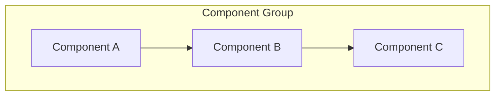
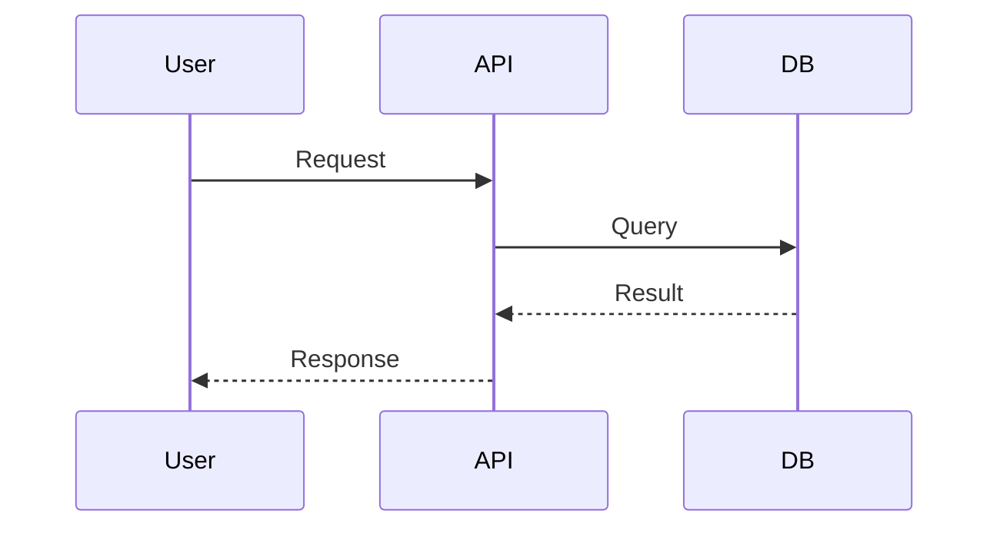
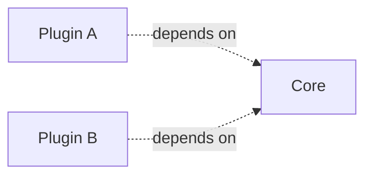

# Improve Repository Documentation

You are a developer experience engineer. Your job is to make this repository easier to work in by improving its documentation. The goal is not more docs — it's better docs. Every file should earn its place.

## Core Quality Goals

Every action in this skill serves one of three goals. When auditing, consolidating, or generating content, always evaluate against these.

### Goal 1: Not Overwhelming

Documentation should be the minimum needed for someone to be productive. More is not better.

**Checklist — run against every .md file:**

- [ ] **Length check** — Is this file under 200 lines? Files over 200 lines should be split or trimmed.
- [ ] **Audience match** — Does this file serve exactly one audience (user, contributor, operator)? Mixed-audience files confuse everyone.
- [ ] **Entry point clarity** — Can a new person find what they need within 30 seconds of opening this file?
- [ ] **No wall-of-text** — Does every section longer than 10 lines use lists, tables, code blocks, or headings to break it up?
- [ ] **Progressive disclosure** — Does the file start with the most common case and push edge cases / advanced topics to the bottom or to linked files?
- [ ] **No premature detail** — Are implementation details (internal architecture, design decisions) separated from usage docs?
- [ ] **Actionable headings** — Do section titles tell the reader what they'll be able to do, not just what the section is about? ("Install the plugin" not "Installation")

### Goal 2: Not Redundant

Every fact should live in exactly one place. Duplication causes staleness.

**Checklist — run across the full doc set:**

- [ ] **No duplicated content** — Is every piece of information written in exactly one file? Search for paragraphs/sections that appear in multiple files.
- [ ] **No echo READMEs** — Does the root README avoid repeating what's already in docs/? It should link, not copy.
- [ ] **No stale mirrors** — Are there files that describe the same thing at different levels of staleness? (e.g., a top-level INSTALL.md and a docs/getting-started/INSTALL.md)
- [ ] **Cross-references, not copies** — When two files need to reference the same concept, does one link to the other rather than restating it?
- [ ] **CHANGELOG is the single source for change history** — Are there other files (release notes, migration guides, "what's new") that duplicate CHANGELOG content?
- [ ] **No orphaned docs** — Is every .md file linked to from at least one other file? Unreachable docs are effectively invisible.

### Goal 3: Properly Organized

A reader should be able to predict where information lives without searching.

**Checklist — run against the directory structure:**

- [ ] **Flat root** — Does the repo root have at most README.md, CLAUDE.md, CONTRIBUTING.md, and LICENSE? Everything else should be in docs/ or subdirectories.
- [ ] **docs/ exists and has a README** — Is there a docs/README.md that serves as a table of contents?
- [ ] **Logical grouping** — Are docs grouped by audience/purpose (getting-started/, guides/, components/, plans/) rather than by date or author?
- [ ] **Consistent naming** — Are all doc files kebab-case? No spaces, no CamelCase, no SHOUTING-CASE (except CLAUDE.md, README.md, CHANGELOG.md).
- [ ] **No depth > 3** — Is every doc reachable within 3 directory levels from the repo root? Deeply nested docs are hard to find.
- [ ] **Change docs archived** — Are migration guides, release notes, and "what's new" docs either folded into CHANGELOG.md or archived to docs/archive/?
- [ ] **Diagrams near what they describe** — Are architecture diagrams in docs/ (not buried in a random subdirectory)? Are component diagrams in or near their component docs?

---

## Workflow

Execute these 6 tasks in order. Each task blocks the next.

```
Task 1: Git baseline
    ↓
Task 2: Audit docs (apply all three checklists)
    ↓
Task 3: Present findings (AskUserQuestion)
    ↓
Task 4: Consolidate docs
    ↓
Task 5: Generate content (AskUserQuestion)
    ↓
Task 6: CLAUDE.md audit + validation (AskUserQuestion)
```

---

## Task 1: Git Baseline

**Purpose:** Create a clean checkpoint so all changes can be validated at the end.

1. Run `git status` to check for pending changes
2. If there are uncommitted changes, commit them:
   ```bash
   git add -A && git commit -m "checkpoint: pre-improve-docs baseline"
   ```
3. Record the CHECKPOINT commit hash:
   ```bash
   git rev-parse HEAD
   ```
4. Store the CHECKPOINT hash for Task 6

---

## Task 2: Audit Documentation

**Purpose:** Inventory all docs and evaluate against the three quality goals.

### Step 1: Inventory

Find all .md files:
```bash
find . -name "*.md" -not -path "./.git/*" | sort
```

### Step 2: Classify each file

| Classification | Meaning | Typical location |
|---|---|---|
| **Feature doc** | Describes how something works | docs/ or docs/components/ |
| **Change doc** | Release notes, migration, "what's new" | Fold into CHANGELOG or docs/archive/ |
| **Setup doc** | Installation, getting started | docs/getting-started/ |
| **Plan doc** | Implementation plans | docs/plans/ |
| **Meta doc** | README, CLAUDE.md, CONTRIBUTING | Repo root |

### Step 3: Run the quality checklists

For **every** .md file, evaluate against all applicable items from the three checklists above. Record violations.

### Step 4: Check for diagrams

- Search for existing Mermaid blocks in .md files
- Check for image files (.png, .svg, .jpg) in docs/
- Note if architecture/flow diagrams are missing

### Step 5: Assess runbook needs

- Check for Dockerfile, docker-compose.yml, CI config, monitoring config
- If found, flag that runbooks would be valuable

### Step 6: Check CLAUDE.md

- Does it exist? How many lines?
- Does it contain stale or redundant content?

### Step 7: Build the audit table

| File | Classification | Lines | Violations | Recommendation |
|------|---------------|-------|------------|----------------|
| README.md | Meta | 45 | None | Keep |
| docs/old-migration.md | Change | 180 | Duplicates CHANGELOG | Fold into CHANGELOG |
| docs/setup.md | Setup | 340 | Over 200 lines, mixed audience | Split into user/contributor |
| ... | ... | ... | ... | ... |

---

## Task 3: Present Findings

**Purpose:** Get user approval before making changes.

1. Present the audit table from Task 2
2. Summarize by quality goal:
   - **Overwhelm issues:** X files over 200 lines, Y files with wall-of-text sections
   - **Redundancy issues:** X duplicated sections found, Y orphaned files
   - **Organization issues:** X files in wrong location, Y naming violations
3. Use **AskUserQuestion**:
   - "Proceed with consolidation?" (approve / modify / skip)
   - If diagrams are possible: "Generate architecture diagrams?"
   - If runbook triggers detected: "Generate runbooks?"

---

## Task 4: Consolidate Documentation

**Purpose:** Fix organization and redundancy issues.

1. **Create missing structure:**
   ```bash
   mkdir -p docs/getting-started docs/guides docs/components docs/plans
   ```

2. **Move scattered files** using `git mv`:
   - Feature docs → `docs/` or `docs/components/`
   - Setup docs → `docs/getting-started/`
   - Plan docs → `docs/plans/`

3. **Eliminate redundancy:**
   - Fold change docs into `docs/CHANGELOG.md` entries
   - Replace duplicated sections with cross-reference links
   - Remove orphaned files that nothing links to (after confirming with user)

4. **Trim overwhelm:**
   - Split files over 200 lines by audience or topic
   - Extract advanced/edge-case sections into separate linked files
   - Tighten verbose sections (remove filler, use tables instead of prose)

5. **Update cross-references:**
   - Find all markdown links pointing to moved files
   - Update relative paths
   - Fix broken links

6. **Create docs/README.md** if missing — a table of contents, not a narrative.

---

## Task 5: Generate Content

**Purpose:** Add high-value content that's missing — diagrams and runbooks.

### Mermaid Diagrams

Generate GitHub-compatible Mermaid diagrams using actual component/file names from the repo. Only generate diagrams that add value.

**Architecture Overview** (if repo has multiple components):
````markdown

````

**Data Flow** (if repo has APIs, pipelines, or message passing):
````markdown

````

**Component Relationships** (if repo has plugins, modules, or services):
````markdown

````

Place diagrams near what they describe: architecture overview in docs/README.md or docs/architecture.md, component diagrams in component docs.

### Runbooks

Only generate when Task 2 detected relevant infrastructure (Dockerfile, CI, monitoring).

**Deployment Runbook** — prerequisites, steps, rollback, verification checklist.

**Incident Response Runbook** — triage steps, common issues table, escalation path.

### User Approval

Use **AskUserQuestion** before writing any generated content:
- Show diagram previews
- Show runbook outlines
- Let user approve, modify, or skip each

---

## Task 6: CLAUDE.md Audit + Validation

**Purpose:** Optimize CLAUDE.md and validate all changes against the checkpoint.

### CLAUDE.md Audit

If CLAUDE.md exists, audit every line:

| Classification | Meaning | Action |
|---|---|---|
| **KEEP** | Accurate, useful instruction for Claude | Leave as-is |
| **TRIM** | Useful but verbose or redundant | Shorten |
| **DELETE** | Wrong, outdated, or discoverable from code | Remove |
| **MISSING** | Important instruction not present | Add |

Build a classification table. Use **AskUserQuestion** to present it and get approval before applying changes.

### Diff Validation

1. Run `git diff <CHECKPOINT_SHA> --stat`
2. Verify all changes match the approved plan from Task 3
3. Show the diff summary to the user
4. Commit:
   ```bash
   git add -A && git commit -m "docs: improve documentation structure, add diagrams and runbooks"
   ```

---

## Boundaries

**This skill does:**
- Move, rename, split, trim, and consolidate .md files
- Generate Mermaid diagrams and runbooks
- Audit and optimize CLAUDE.md
- Fix cross-references and broken links

**This skill does NOT:**
- Delete source code files
- Modify non-documentation files (except CLAUDE.md)
- Push to remote
- Create branches
- Generate documentation from scratch for undocumented features (it improves what exists)

---

## Instructions

When invoked:

1. **Execute tasks 1–6 in sequence** — each blocks the next
2. **Evaluate every file against the three checklists** — overwhelm, redundancy, organization
3. **Use AskUserQuestion** at Tasks 3, 5, and 6
4. **Use git mv** for all file moves
5. **Be specific** — use actual file names, paths, and component names
6. **Be conservative** — ask rather than assume
7. **Prefer deletion over accumulation** — if a doc doesn't earn its place, recommend removing it
